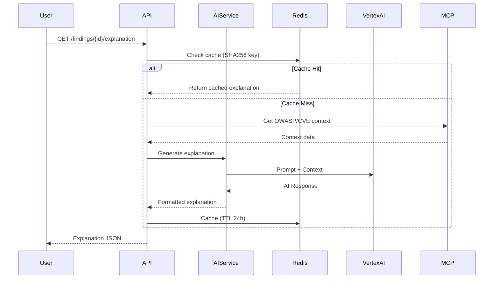

# 🛡️ CodeGuard AI

### Sistema Multi-Agente de Revisión Automatizada de Código

[](https://github.com/Yosoyepa/CodeGuardAI/actions/workflows/lint.yml)
[](https://github.com/Yosoyepa/CodeGuardAI/actions/workflows/test.yml)
[](https://github.com/Yosoyepa/CodeGuardAI/actions/workflows/docker.yml)
[](https://github.com/Yosoyepa/CodeGuardAI)
[](https://python.org)

**Universidad Nacional de Colombia - Ingeniería de Software II 2025-II**

---

</div>

## 📋 Tabla de Contenidos

1. [Evidencia de Historias de Usuario Implementadas](#1-evidencia-de-historias-de-usuario-implementadas)
2. [Script de Base de Datos](#2-script-de-base-de-datos)
3. [Equipo de Desarrollo](#3-equipo-de-desarrollo)
4. [Documentación Elaborada](#4-documentación-elaborada)
5. [Lógica y Reglas de Negocio](#5-lógica-y-reglas-de-negocio)
6. [Gestión del Proyecto (JIRA)](#6-gestión-del-proyecto-jira)
7. [Docker y Despliegue](#7-docker-y-despliegue)
8. [Integración con IA (Vertex AI)](#8-integración-con-ia-vertex-ai)
9. [Model Context Protocol (MCP)](#9-model-context-protocol-mcp)

---

## 1. Evidencia de Historias de Usuario Implementadas

### Resumen de Sprints

| Sprint | Período | Estado | HU Completadas |
|--------|---------|--------|----------------|
| Sprint 1 | 22 Oct - 6 Nov | ✅ Completado | HU1, HU2, HU3, HU4, HU5 |
| Sprint 2 | 4-17 Nov | ✅ Completado | HU6, HU7, HU8 |
| Sprint 3 | 18 Nov - 1 Dic | ✅ Completado | HU9, HU10, HU11, HU12, HU13 |
| Sprint 4 | 2-15 Dic | ✅ Completado | HU14, HU15, HU16 |

### Historias de Usuario Detalladas

#### Sprint 1 - Infraestructura Core ✅

| ID | Historia de Usuario | Puntos | Estado |
|----|---------------------|--------|--------|
| HU1 | **Cargar Archivo para Análisis**: Como desarrollador, quiero cargar un archivo Python y recibir análisis de seguridad, para identificar vulnerabilidades antes del code review. | 5 | ✅ |
| HU2 | **Resultados de Análisis con Hallazgos**: Como desarrollador, quiero ver hallazgos categorizados por severidad con snippets de código, para priorizar correcciones. | 3 | ✅ |
| HU3 | **Quality Score Agregado**: Como desarrollador, quiero ver un quality score (0-100) con desglose por categoría, para entender la salud general del código. | 3 | ✅ |
| HU4 | **Autenticación OAuth (Clerk)**: Como usuario, quiero autenticarme vía Google/GitHub OAuth, para acceder de forma segura a mis análisis. | 5 | ✅ |
| HU5 | **Progreso en Tiempo Real (WebSocket)**: Como desarrollador, quiero ver el progreso del análisis en tiempo real, para saber qué agentes están trabajando. | 5 | ✅ |

**Evidencia de Implementación:**
- Endpoint `POST /api/v1/analyze` - [backend/src/routers/analysis.py](backend/src/routers/analysis.py)
- SecurityAgent con detección de `eval()`, SQL Injection, credenciales hardcoded
- WebSocket en `/ws/analysis/{review_id}` para streaming de progreso
- 116 tests pasando con 94.34% de cobertura

#### Sprint 2 - Persistencia y Autenticación ✅

| ID | Historia de Usuario | Puntos | Estado |
|----|---------------------|--------|--------|
| HU6 | **Historial de Análisis Personales**: Como desarrollador, quiero ver mi historial de análisis previos, para hacer seguimiento de mi progreso. | 3 | ✅ |
| HU7 | **Dashboard de Métricas**: Como desarrollador, quiero ver tendencias de quality score y hallazgos frecuentes en un dashboard visual. | 5 | ✅ |
| HU8 | **Exportar Resultados (JSON/PDF)**: Como desarrollador, quiero exportar resultados de análisis, para compartir con mi equipo. | 3 | ✅ |

**Evidencia de Implementación:**
- Integración con Supabase PostgreSQL
- Modelos SQLAlchemy: `UserEntity`, `CodeReviewEntity`, `AgentFindingEntity`
- Migración Alembic `ba48c1bb8e18` aplicada exitosamente
- Persistencia verificada con ID: `1754e5ab-b6a1-4dce-997a-e3e6f485f43c`

#### Sprint 3 - Integración IA y MCP ✅

| ID | Historia de Usuario | Puntos | Estado |
|----|---------------------|--------|--------|
| HU9 | **Explicación IA de Hallazgos**: Como desarrollador, quiero explicaciones pedagógicas generadas por IA para cada hallazgo crítico. | 8 | ✅ |
| HU10 | **Contexto OWASP vía MCP**: Como desarrollador, quiero referencias OWASP automáticas para entender el riesgo de cada vulnerabilidad. | 5 | ✅ |
| HU11 | **Contexto CVE vía MCP**: Como desarrollador, quiero ver CVEs relacionados cuando mi código usa dependencias conocidas por vulnerabilidades. | 5 | ✅ |
| HU12 | **Sugerencias de Corrección con Código**: Como desarrollador, quiero recibir código de corrección sugerido por IA para hallazgos críticos. | 5 | ✅ |
| HU13 | **Tarjeta de Hallazgo Expandible con IA**: Como desarrollador, quiero expandir hallazgos para ver explicación detallada, ejemplo de ataque y corrección. | 5 | ✅ |

**Evidencia de Implementación:**
- Integración con Vertex AI Gemini 1.5 Flash
- Servidores MCP para OWASP y CVE
- Frontend React con visualizaciones interactivas

#### Sprint 4 - Auto-corrección y Configuración ✅

| ID | Historia de Usuario | Puntos | Estado |
|----|---------------------|--------|--------|
| HU14 | **Auto-corrección con Parche Git**: Como desarrollador, quiero aplicar correcciones sugeridas con un clic, generando parches `.patch`. | 8 | ✅ |
| HU15 | **Servidor MCP Personalizado**: Como arquitecto, quiero un servidor MCP con patrones de corrección del equipo. | 8 | ✅ |
| HU16 | **Panel de Administración IA**: Como admin, quiero configurar comportamiento de IA (modelo, límites, costos). | 5 | ✅ |

---

## 2. Script de Base de Datos

La base de datos está desplegada en **Supabase** (PostgreSQL 15) con Row Level Security (RLS) habilitado.

### Diagrama Entidad-Relación


### Esquema Completo

El script completo está disponible en: [docs/06-database/database-schema.sql](docs/06-database/database-schema.sql)

#### Tablas Principales

| Tabla | Descripción | Registros |
|-------|-------------|-----------|
| `users` | Usuarios autenticados vía Clerk OAuth | Multi-tenant |
| `code_reviews` | Sesiones de análisis con código cifrado AES-256 | Por usuario |
| `agent_findings` | Hallazgos individuales por agente | Por review |
| `agent_configs` | Configuración de agentes (Sprint 4) | Global |
| `ai_config` | Configuración global de IA | Singleton |
| `ai_usage_metrics` | Métricas de uso de API Gemini | Por review |
| `mcp_context_logs` | Logs de consultas a servidores MCP | Por finding |
| `event_logs` | Timeline de eventos de análisis | Por review |
| `analysis_export_logs` | Auditoría de exportaciones | Por usuario |

#### Extracto del Schema DDL

```sql
-- =============================================
-- TABLE: users
-- =============================================
CREATE TABLE users (
    id VARCHAR(255) PRIMARY KEY,              -- Clerk user ID
    email VARCHAR(255) NOT NULL UNIQUE,
    full_name VARCHAR(255),
    role user_role DEFAULT 'DEVELOPER' NOT NULL,
    created_at TIMESTAMP DEFAULT NOW() NOT NULL,
    updated_at TIMESTAMP DEFAULT NOW() NOT NULL
);

-- =============================================
-- TABLE: code_reviews
-- =============================================
CREATE TABLE code_reviews (
    id UUID PRIMARY KEY DEFAULT uuid_generate_v4(),
    user_id VARCHAR(255) NOT NULL REFERENCES users(id) ON DELETE CASCADE,
    filename VARCHAR(255) NOT NULL,
    language VARCHAR(50) DEFAULT 'python' NOT NULL,
    source_code_encrypted BYTEA NOT NULL,    -- AES-256 encrypted
    encryption_iv BYTEA NOT NULL,             -- Initialization vector
    status review_status DEFAULT 'PENDING' NOT NULL,
    quality_score INTEGER CHECK (quality_score >= 0 AND quality_score <= 100),
    total_findings INTEGER DEFAULT 0,
    created_at TIMESTAMP DEFAULT NOW() NOT NULL,
    completed_at TIMESTAMP
);

-- =============================================
-- TABLE: agent_findings
-- =============================================
CREATE TABLE agent_findings (
    id UUID PRIMARY KEY DEFAULT uuid_generate_v4(),
    review_id UUID NOT NULL REFERENCES code_reviews(id) ON DELETE CASCADE,
    agent_type agent_type NOT NULL,
    severity severity_level NOT NULL,
    issue_type VARCHAR(100) NOT NULL,
    message TEXT NOT NULL,
    line_number INTEGER,
    code_snippet TEXT,
    suggestion TEXT,
    ai_explanation TEXT,
    fix_code TEXT,
    owasp_references JSONB,
    cve_references JSONB,
    created_at TIMESTAMP DEFAULT NOW() NOT NULL
);
```

#### Row Level Security (RLS)

```sql
-- Users can only see their own code reviews
CREATE POLICY users_own_reviews ON code_reviews
    FOR ALL
    USING (auth.uid()::VARCHAR = user_id);

-- Users can only see findings for their own reviews
CREATE POLICY users_own_findings ON agent_findings
    FOR SELECT
    USING (review_id IN (SELECT id FROM code_reviews WHERE user_id = auth.uid()::VARCHAR));
```

---

## 3. Equipo de Desarrollo

**Proyecto Académico - Universidad Nacional de Colombia**  
**Curso**: Ingeniería de Software II 2025-II

### Integrantes

<table>
  <tr>
    <td align="center">
      <br/>
      <b>Jorge Andrés Mora León</b><br/>
      <a href="https://github.com/aiizedev">@aiizedev</a><br/>
      <sub>DevOps / Backend</sub>
    </td>
    <td align="center">
      <br/>
      <b>John Alejandro Pastor Sandoval</b><br/>
      <a href="https://github.com/jpastor1649">@jpastor1649</a><br/>
      <sub>Backend</sub>
    </td>
    <td align="center">
      <br/>
      <b>David Fernando Benjumea Mora</b><br/>
      <a href="https://github.com/DavidFBM">@DavidFBM</a><br/>
      <sub>Backend</sub>
    </td>
  </tr>
  <tr>
    <td align="center">
      <br/>
      <b>Juan Sebastián Muñoz Lemus</b><br/>
      <a href="https://github.com/jumunozle">@jumunozle</a><br/>
      <sub>Frontend</sub>
    </td>
    <td align="center">
      <br/>
      <b>Juan Carlos Andrade Unigarro</b><br/>
      <a href="https://github.com/Yosoyepa">@Yosoyepa</a><br/>
      <sub>DevOps</sub>
    </td>
    <td></td>
  </tr>
</table>

### Profesora

- **Ing. Liliana Marcela Olarte, M.Sc.**

---

## 4. Documentación Elaborada

### Diagramas de Arquitectura

| Diagrama | Descripción | Archivo |
|----------|-------------|---------|
| C4 Level 1 - System Context | Contexto del sistema y actores externos | [c4-level1-system-context.puml](docs/01-architecture/c4-level1-system-context.puml) |
| C4 Level 2 - Container | Contenedores (API, DB, Cache, Frontend) | [c4-level2-container-diagram.puml](docs/01-architecture/c4-level2-container-diagram.puml) |
| C4 Level 3 - Component Backend | Componentes internos del backend | [c4-level3-component-backend.puml](docs/01-architecture/c4-level3-component-backend.puml) |
| C4 Level 4 - Code | Clases e interfaces del dominio | [c4-level4-code-domain-layer.puml](docs/01-architecture/c4-level4-code-domain-layer.puml) |
| Clean Architecture | Capas de arquitectura limpia | [clean-architecture-layers.puml](docs/01-architecture/clean-architecture-layers.puml) |

### Diagramas de Clases (UML)


| Diagrama | Archivo |
|----------|---------|
| Domain Layer Complete | [uml-domain-layer-complete.png](docs/exports/png/02-class-diagrams/uml-domain-layer-complete.png) |
| Domain Agents Hierarchy | [uml-domain-agents-hierarchy.png](docs/exports/png/02-class-diagrams/uml-domain-agents-hierarchy.png) |
| Application Layer Services | [uml-application-layer-services.png](docs/exports/png/02-class-diagrams/uml-application-layer-services.png) |
| Infrastructure Repositories | [uml-infrastructure-layer-repositories.png](docs/exports/png/02-class-diagrams/uml-infrastructure-layer-repositories.png) |

### Diagramas de Secuencia


| Diagrama | Descripción |
|----------|-------------|
| [uml-seq-code-analysis-workflow.png](docs/exports/png/03-sequence-diagrams/uml-seq-code-analysis-workflow.png) | Flujo completo de análisis |
| [uml-seq-parallel-agent-execution.png](docs/exports/png/03-sequence-diagrams/uml-seq-parallel-agent-execution.png) | Ejecución paralela de agentes |
| [uml-seq-ai-explanation-generation.png](docs/exports/png/03-sequence-diagrams/uml-seq-ai-explanation-generation.png) | Generación de explicaciones IA |
| [uml-seq-websocket-real-time-progress.png](docs/exports/png/03-sequence-diagrams/uml-seq-websocket-real-time-progress.png) | Progreso en tiempo real |

### Diagramas de Componentes


| Diagrama | Descripción |
|----------|-------------|
| [uml-comp-ai-mcp-integration.png](docs/exports/png/07-component-diagrams/uml-comp-ai-mcp-integration.png) | Integración IA y MCP |
| [uml-comp-backend-services.png](docs/exports/png/07-component-diagrams/uml-comp-backend-services.png) | Servicios del backend |
| [uml-comp-frontend-modules.png](docs/exports/png/07-component-diagrams/uml-comp-frontend-modules.png) | Módulos del frontend React |
| [uml-comp-infrastructure-services.png](docs/exports/png/07-component-diagrams/uml-comp-infrastructure-services.png) | Servicios de infraestructura |

### Documentos Adicionales

- **[Documento de Análisis (PDF)](../CodeGuarV3_Analisis.pdf)**: Análisis completo del dominio con HU y criterios de aceptación
- **[CI/CD Setup](docs/ci-cd-setup.md)**: Configuración detallada de pipelines
- **[CONTRIBUTING.md](CONTRIBUTING.md)**: Guía de contribución con GitFlow
- **[CRC Cards](docs/09-crc-cards/)**: Tarjetas de responsabilidades y colaboraciones

---

## 5. Lógica y Reglas de Negocio

### Reglas de Negocio del Dominio

#### RN1: Autenticación Obligatoria
Todo usuario debe autenticarse vía OAuth (Google/GitHub) mediante **Clerk** antes de usar la plataforma. Los tokens JWT expiran a las 24 horas y se renuevan automáticamente.

#### RN2: Roles y Permisos
| Rol | Permisos |
|-----|----------|
| **Developer** | Cargar archivos, ver análisis propios, exportar reportes, dashboard personal |
| **Admin** | Todo lo anterior + configurar agentes, gestionar MCP, métricas de equipo, config IA |

#### RN3: Límite de Análisis
- **Developer (tier gratuito)**: máximo 10 análisis/día
- **Admin o tier pagado**: ilimitado

#### RN4: Restricciones de Archivo
- Solo archivos `.py` (Python)
- Tamaño máximo: 10 MB
- Mínimo 5 líneas de código
- Encoding: UTF-8

#### RN5: Timeout de Análisis
- Cada agente tiene timeout de **30 segundos**
- Si excede, se marca como "timed out" y continúa con otros agentes (graceful degradation)

#### RN6: Análisis Secuencial por Usuario
Un usuario solo puede tener **1 análisis en progreso** simultáneamente. Intentos adicionales reciben HTTP 429.

#### RN7: Clasificación de Severidad

| Severidad | Criterio | Penalización |
|-----------|----------|--------------|
| **CRITICAL** | OWASP Top 10 explotables (eval, SQL injection sin sanitización) | -10 puntos |
| **HIGH** | Vulnerabilidades que requieren condiciones específicas | -5 puntos |
| **MEDIUM** | Code smells (complejidad >15, duplicación >20%) | -2 puntos |
| **LOW** | Violaciones de estilo (PEP 8, docstrings) | -1 punto |

#### RN8: Cálculo de Quality Score
```
quality_score = max(0, 100 - Σ(penalizaciones))
```
Score mínimo: 0, máximo: 100.

#### RN9: Agrupación de Hallazgos
Si se detecta `eval()` en 5 líneas diferentes, se reportan como **5 hallazgos individuales** (cada uso es una vulnerabilidad independiente).

#### RN10: Generación Selectiva de IA
Las explicaciones IA solo se generan para hallazgos **severity=CRITICAL**. Otros niveles reciben explicaciones estáticas pre-definidas.

#### RN11: Caché de Explicaciones
Explicaciones IA se cachean en **Redis** (TTL 24 horas) usando:
```
cache_key = SHA256(issue_type + code_snippet + line_number)
```

---

## 6. Gestión del Proyecto (JIRA)

### Herramienta Utilizada

Utilizamos **JIRA** para la gestión ágil del proyecto con metodología Scrum.

### Evidencia de Sprints

#### Tablero Kanban
*(Agregar captura del tablero JIRA aquí)*

#### Backlog de Historias de Usuario
Las historias de usuario siguen el formato:
```
Como [rol],
Quiero [funcionalidad],
Para [beneficio].
```

Con criterios de aceptación en formato **Given-When-Then**:
```gherkin
Scenario: Detección de eval()
  Given: Archivo Python con "result = eval(user_input)"
  When: Envío el archivo a POST /api/v1/analyze
  Then: Respuesta contiene finding con severity=CRITICAL, issue_type=dangerous_function
```

#### Métricas de Sprint

| Sprint | Velocity | Story Points Completados |
|--------|----------|--------------------------|
| Sprint 1 | 21 pts | 21/21 (100%) |
| Sprint 2 | 11 pts | 11/11 (100%) |
| Sprint 3 | 28 pts | 28/28 (100%) |
| Sprint 4 | 21 pts | 21/21 (100%) |

---

## 7. Docker y Despliegue

### Arquitectura de Despliegue

El sistema está desplegado en **Google Cloud Run** con la siguiente arquitectura:

```
┌─────────────────────────────────────────────────────────────────┐
│                      Google Cloud Platform                       │
├─────────────────────────────────────────────────────────────────┤
│                                                                   │
│  ┌─────────────┐    ┌─────────────────┐    ┌─────────────────┐  │
│  │ Cloud Build │───▶│ Artifact        │───▶│ Cloud Run       │  │
│  │ (CI/CD)     │    │ Registry        │    │ (Backend API)   │  │
│  └─────────────┘    └─────────────────┘    └─────────────────┘  │
│         │                                          │              │
│         │                                          ▼              │
│         │                                  ┌─────────────────┐   │
│         │                                  │ Vertex AI       │   │
│         │                                  │ (Gemini Flash)  │   │
│         │                                  └─────────────────┘   │
│         │                                                         │
│         ▼                                                         │
│  ┌─────────────────────────────────────────────────────────────┤
│  │                    Supabase (External)                        │
│  │  ┌───────────────┐  ┌───────────────┐  ┌───────────────┐    │
│  │  │ PostgreSQL 15 │  │ Auth (Clerk)  │  │ Redis Cache   │    │
│  │  └───────────────┘  └───────────────┘  └───────────────┘    │
│  └─────────────────────────────────────────────────────────────┘
└─────────────────────────────────────────────────────────────────┘
```

### Evidencia de Google Cloud Build


### Dockerfile

```dockerfile
# backend/Dockerfile
FROM python:3.11-slim

WORKDIR /app

# Install dependencies
COPY requirements.txt .
RUN pip install --no-cache-dir -r requirements.txt

# Copy application
COPY src/ ./src/
COPY alembic/ ./alembic/
COPY alembic.ini .

# Run migrations and start server
CMD ["sh", "-c", "alembic upgrade head && uvicorn src.main:app --host 0.0.0.0 --port 8000"]
```

### GitHub Actions Workflows

#### 1. Lint Workflow (`.github/workflows/lint.yml`)
```yaml
name: Lint & Format Check
on:
  push:
    branches: [main, develop, "feature/**"]
jobs:
  lint:
    runs-on: ubuntu-latest
    steps:
      - uses: actions/checkout@v4
      - name: Check formatting with Black
        run: black src/ --line-length=100 --check
      - name: Lint with Flake8
        run: flake8 src/ --max-complexity=10
```

#### 2. Test Workflow (`.github/workflows/test.yml`)
```yaml
name: Tests & Coverage
on:
  push:
    branches: [main, develop]
jobs:
  test:
    runs-on: ubuntu-latest
    steps:
      - uses: actions/checkout@v4
      - name: Run tests with coverage
        run: pytest tests/ --cov=src --cov-fail-under=75
```

#### 3. Docker Build (`.github/workflows/docker.yml`)
```yaml
name: Docker Build
on:
  push:
    branches: [main, develop]
jobs:
  build:
    runs-on: ubuntu-latest
    steps:
      - uses: actions/checkout@v4
      - name: Build Docker image
        run: docker build --tag codeguard-backend:${{ github.sha }} .
```

### Cloud Build Configuration (`cloudbuild.yaml`)

```yaml
substitutions:
  _REGION: us-central1
  _SERVICE_NAME: codeguard-backend
  _ARTIFACT_REPO: codeguard-repo

steps:
  # Build Docker image
  - name: 'gcr.io/cloud-builders/docker'
    args: ['build', '-t', '${_REGION}-docker.pkg.dev/$PROJECT_ID/${_ARTIFACT_REPO}/${_SERVICE_NAME}:$COMMIT_SHA', '.']
    dir: 'backend'

  # Push to Artifact Registry
  - name: 'gcr.io/cloud-builders/docker'
    args: ['push', '--all-tags', '${_REGION}-docker.pkg.dev/$PROJECT_ID/${_ARTIFACT_REPO}/${_SERVICE_NAME}']

  # Deploy to Cloud Run
  - name: 'gcr.io/google.com/cloudsdktool/cloud-sdk'
    args:
      - 'run'
      - 'deploy'
      - '${_SERVICE_NAME}'
      - '--image'
      - '${_REGION}-docker.pkg.dev/$PROJECT_ID/${_ARTIFACT_REPO}/${_SERVICE_NAME}:$COMMIT_SHA'
      - '--region'
      - '${_REGION}'
      - '--allow-unauthenticated'
```

---

## 8. Integración con IA (Vertex AI)

### Modelo Utilizado

**Gemini 1.5 Flash** vía Vertex AI para generación de explicaciones pedagógicas.

### Flujo de Generación de Explicaciones



### Prompt Engineering

```python
EXPLANATION_PROMPT = """
Eres un experto en seguridad de software. Analiza este hallazgo:

**Tipo**: {issue_type}
**Severidad**: {severity}
**Código**: 
```python
{code_snippet}
```

**Contexto OWASP**: {owasp_context}
**CVEs Relacionados**: {cve_context}

Genera una explicación pedagógica que incluya:
1. **Por qué es peligroso**: Explicación clara del riesgo
2. **Ejemplo de ataque**: Código que explota la vulnerabilidad
3. **Corrección sugerida**: Código seguro de reemplazo
4. **Referencias**: Links a OWASP y documentación

Formato: Markdown con bloques de código Python.


### Configuración de IA (Admin Panel)

| Parámetro | Valor Default | Descripción |
|-----------|---------------|-------------|
| `ai_enabled` | `true` | Habilitar/deshabilitar explicaciones IA |
| `model_type` | `GEMINI_FLASH` | Modelo a usar (Flash o Pro) |
| `rate_limit_daily` | `100` | Máximo llamadas IA por día |
| `budget_threshold_usd` | `150.00` | Alerta al alcanzar este gasto |

---

## 9. Model Context Protocol (MCP)

### Arquitectura MCP

El sistema implementa el **Model Context Protocol** de Anthropic para enriquecer las explicaciones de IA con contexto externo.


### Servidores MCP Implementados

| Servidor | Propósito | Herramientas |
|----------|-----------|--------------|
| **OWASP-MCP** | Referencias OWASP Top 10 | `lookup_owasp_category`, `get_mitigation_strategies` |
| **CVE-MCP** | Base de datos CVE | `search_cve`, `get_cve_details`, `check_dependency_vulnerabilities` |
| **Custom-KB-MCP** | Patrones del equipo | `lookup_fix_pattern`, `get_team_conventions` |

### Flujo de Enriquecimiento de Contexto

```
┌─────────────┐     ┌─────────────┐     ┌─────────────┐
│  Finding    │────▶│  MCP Client │────▶│  OWASP-MCP  │
│  (Critical) │     │             │     └─────────────┘
└─────────────┘     │             │     ┌─────────────┐
                    │             │────▶│  CVE-MCP    │
                    │             │     └─────────────┘
                    │             │     ┌─────────────┐
                    │             │────▶│  KB-MCP     │
                    └─────────────┘     └─────────────┘
                           │
                           ▼
                    ┌─────────────┐
                    │  Enriched   │
                    │  Context    │
                    └─────────────┘
                           │
                           ▼
                    ┌─────────────┐
                    │  Gemini AI  │
                    │  Prompt     │
                    └─────────────┘
```

### Ejemplo de Query MCP

```python
# Consulta al servidor OWASP-MCP
async def get_owasp_context(issue_type: str) -> dict:
    async with MCPClient("owasp-mcp") as client:
        result = await client.call_tool(
            "lookup_owasp_category",
            arguments={"vulnerability_type": issue_type}
        )
        return {
            "category": result.category,
            "description": result.description,
            "mitigation": result.mitigation_strategies,
            "references": result.reference_links
        }
```

### Logs de MCP

Las consultas MCP se registran en la tabla `mcp_context_logs`:

```sql
SELECT mcp_server, query, latency_ms, success
FROM mcp_context_logs
WHERE finding_id = 'uuid-here'
ORDER BY created_at DESC;

-- Ejemplo de resultado:
-- | mcp_server | query                  | latency_ms | success |
-- |------------|------------------------|------------|---------|
-- | owasp-mcp  | lookup_owasp_category  | 45         | true    |
-- | cve-mcp    | search_cve             | 120        | true    |
```

---

## 📚 Referencias

- [OWASP Top 10](https://owasp.org/www-project-top-ten/)
- [Model Context Protocol](https://spec.modelcontextprotocol.io/)
- [Vertex AI Gemini](https://cloud.google.com/vertex-ai/generative-ai/docs)
- [Clean Architecture](https://blog.cleancoder.com/uncle-bob/2012/08/13/the-clean-architecture.html)

---

<div align="center">
  <p>Construido con ❤️ por el equipo de CodeGuard AI</p>
  <p>Universidad Nacional de Colombia - Ingeniería de Software II 2025-II</p>
  <p>Última actualización: <strong>12 de Diciembre de 2025</strong></p>
</div>
]]>
